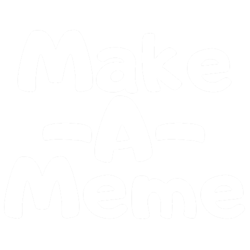

<h1>Tribuo<h1>

<h2><u>Overview:</u><h2>
<h4>Make-A-Meme is an in browser meme template library that allows the user to find, create, and favorite memes/templates.</h4>

<h2><u>What was used:</u></h3>
<h3>Technolgies:</h3>
<ul>
    <li>React</li>
    <li>Redux</li>
    <li>HTML5</li>
    <li>CSS3</li>
    <li>JavaScript</li>
    <li>Material UI</li>
  
</ul>

<h3>API:</h3>
<ul>
    <li>https://api.imgflip.com/get_memes</li>
</ul>

<h3>Other:</h3>
<ul>
    <li>Photoshop</li>
    <li>Adobe XD</li>
</ul>

 

<h2><u>MVP (Minimum Viable Product):</u></h2>
<ul>
    <li>Create a React web application using React-Redux</li>
    <li>Responsive design</li>
</ul>

 

<h2><u>Stretch Goals Future:</u></h2>
<ul>
<li>Add functionality for unliking memes</li>
<li>Add cookies to the website so items added to the favorites section get saved.</li>
<li>Allow the ability to create memes from templates in browser.</li>
<li>Add search bar</li>
</ul>

 

<h2>Live Demo</h2>
[insert website url here]
 

<h2>Screenshots:</h2>

<h4>Highlights the homepage/templates page of Make-A-Meme.</h4>
 

<h2>Built by: </h2>
<h3>Jaye Jensen: https://github.com/jaye-j</h3>
